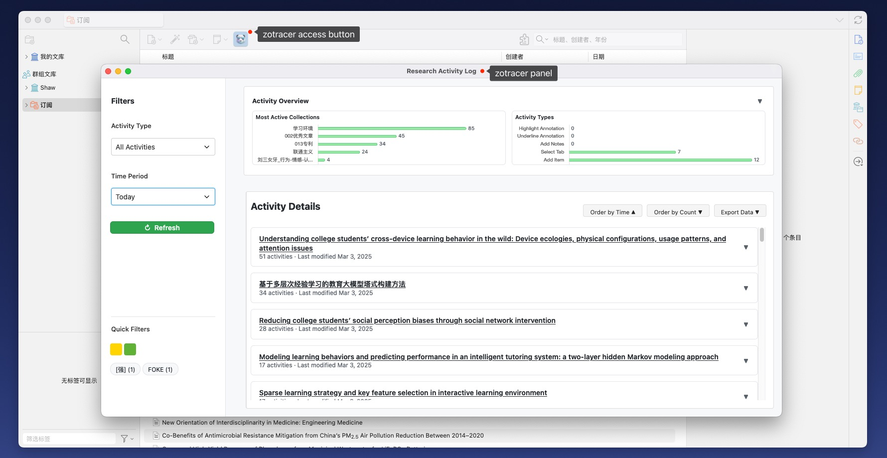

    
     
    

        
        
        
        
        
         
        
        
    

    English | <a href="doc/README-zhCN.md">简体中文</a>

## Introduction

zotracer is a [Zotero](https://www.zotero.org/) plugin that not only tracks and records your research activities (such as reading and saving references), but also generates detailed timeline views and supports seamless export of research notes to knowledge management platforms like [Flomo](https://flomoapp.com/). Analyze your study habits and streamline your research process with ease.

> [!tip]
> 👁 Watch this repo so that you can be notified whenever there are fixes & updates.
> 🔥 The plugin is available for download from the [Zotero Add-ons](https://github.com/syt2/zotero-addons) repository.

## Screenshot

    

## Features

- **Comprehensive Activity Tracking**

  - Track the complete research process: reading, note-taking, and citation
  - Precisely monitor literature management operations (collection, editing, organization)
  - Real-time tracking of tab usage and reading behavior

- **Quick Location Based on Activity History**

  - Intuitive activity data visualization interface
  - Flexible chronological and activity-based sorting
  - One-click access to literature associated with historical activities

- **Structured Data Export for Specific Workflows**
  - Seamless integration with mainstream knowledge management tools (e.g., [Flomo](https://flomoapp.com/))

## Quick Start

1. Download the plugin from [ZoTracer.xpi](https://github.com/etShaw-zh/zotracer/releases)
2. Install the plugin through Zotero's Add-on Manager
3. Your research activities will be automatically tracked
4. Access activity logs through the plugin's interface
5. Analyze your research patterns and optimize your workflow (coming soon)

## Acknowledgments

- [zotero](https://www.zotero.org/): An open-source software focusing on literature management
- [zotero-plugin-template](https://github.com/windingwind/zotero-plugin-template): A Zotero plugin template
- [zotero-addons](https://github.com/syt2/zotero-addons): An unofficial Zotero plugin market
- [zotero-plugins](https://github.com/zotero-chinese/zotero-plugins): A Chinese community for Zotero plugins

## Disclaimer

Use this code under AGPL. No warranties are provided. Keep the laws of your locality in mind!

If you want to change the license, please contact me at <et_shaw@126.com>
