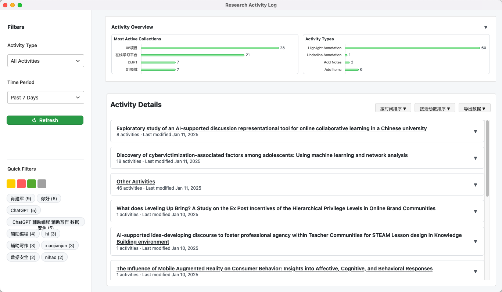

    
     
    

        
        
        
        
        
        
        
    

    <a href="../README.md">English</a> | 简体中文

## 简介

ZoTracer 是一个 [Zotero](https://www.zotero.org/) 插件，它不仅能追踪和记录您的研究活动（如阅读、保存文献等），还能生成详细的时间线视图，并支持将研究笔记无缝导出到 [Flomo](https://flomoapp.com/) 等知识管理平台。

> [!tip]
> 👁 关注此仓库以获取修复和更新的通知。

## 界面预览

    

## 功能特性

- **全面的活动追踪**
  - 记录阅读、写作和引用等研究活动
  - 追踪文献管理操作（添加、编辑、组织）
  - 监控标签页和阅读器使用情况
- **特定工作流的结构化数据导出**
  - 支持自定义导出格式和字段
  - 与其他工具和平台无缝集成 (例如, [Flomo](https://flomoapp.com/))
  - 便于数据分析和可视化
- **AI 辅助的上下文注释（即将推出）**
  - 智能识别和提取关键信息
  - 自动生成标签和摘要建议
  - 基于阅读历史的个性化推荐

## 快速开始

1. 从 [ZoTracer.xpi](https://github.com/etShaw-zh/zotracer/releases) 下载插件
2. 通过 Zotero 的插件管理器安装插件
3. 您的研究活动将被自动追踪
4. 通过插件界面访问活动日志
5. 分析您的研究模式并优化工作流程（即将推出）

## 免责声明

本代码基于 AGPL 许可证使用。不提供任何保证。请遵守您所在地区的法律！

如果您想更改许可证，请通过 <et_shaw@126.com> 联系我
